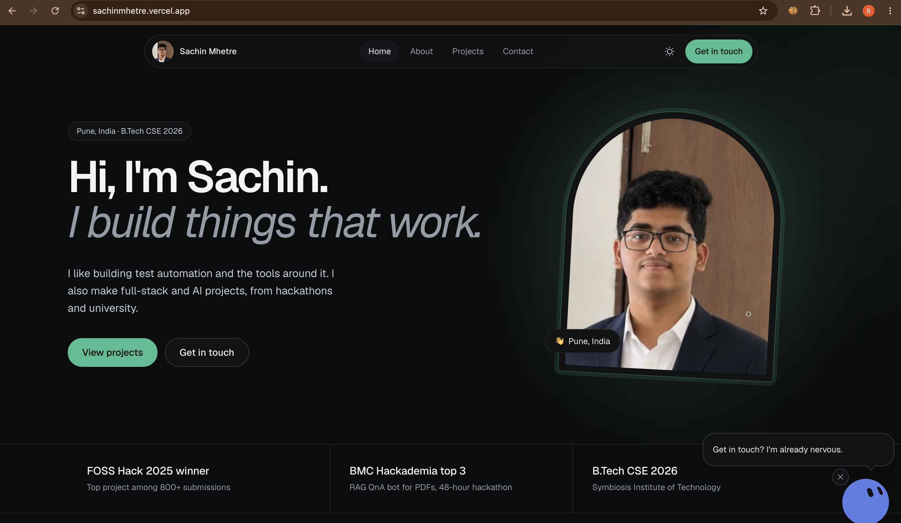

# Sachin Mhetre | Portfolio

Personal portfolio of Sachin Mhetre, a QA automation engineer from Pune, India who builds test automation, the tools around it, and full-stack and AI projects.

**Live site:** https://sachinmhetre.vercel.app



## Highlights

- Dark-first design with a light theme toggle, a single emerald accent and a floating pill navigation
- Home, About, Projects and Contact pages, written in first person
- Project cards with poster visuals that open in an accessible modal (Scribly, Hope, RAG Document Q&A)
- **Strobi**, a small animated mascot with page-aware, scripted speech bubbles (no AI calls, no backend)
- Respects `prefers-reduced-motion`, keyboard navigable, visible focus states
- Static pages, optimized images, sitemap generated at build time

## Tech stack

| Area | Choice |
| --- | --- |
| Framework | Next.js 13.5 (Pages Router), React 18 |
| Language | TypeScript |
| Styling | Tailwind CSS 3 |
| Theming | next-themes (dark by default) |
| Fonts | Geist and Geist Mono, self-hosted with `next/font` |
| Mascot | `@bible-strong/avatar-web` (loaded lazily, after the page is idle) |
| SEO | next-seo, next-sitemap |
| Hosting | Vercel |

## Getting started

Requirements: Node.js 22.12 or newer (the mascot packages require it) and npm.

```bash
git clone https://github.com/SachinMhetre678/Portfolio.git
cd Portfolio
npm install
npm run dev
```

Open http://localhost:3000.

### Scripts

| Command | What it does |
| --- | --- |
| `npm run dev` | Start the development server |
| `npm run build` | Production build, then generate the sitemap |
| `npm run start` | Serve the production build |

> Don't run `npm run build` while `npm run dev` is running. Both write to the `.next` folder and can corrupt it. If that happens, stop everything, run `rm -rf .next` and start again.

## Project structure

```
.
├── docs/                 Project notes and decisions (see below)
├── public/               Static files, project posters, mascot definition (strobi.avatar.json)
├── src/
│   ├── pages/            Routes: /, /about, /projects, /contact, 404
│   ├── modules/          Page sections and components
│   └── common/           Shared components, constants and styles
├── next.config.js
├── next-sitemap.config.js
├── tailwind.config.js
└── vercel.json
```

## Editing content

- **Copy and facts:** `docs/CONTENT_APPROVED.md` is the source of truth for everything shown on the site. Update it whenever the site copy changes.
- **Strobi's lines:** all dialogue lives in one file, `strobiLines.ts`. Each line is a short string, grouped by trigger (page arrival, hover, scroll, idle and so on). Edit freely, keep lines short.
- **Project posters:** images live in `public/images/projects/`. Posters are summaries or concept art, so they are captioned "Project poster".
- **Design tokens:** colors, type scale, spacing and motion are described in `docs/DESIGN_SYSTEM.md`.

## About Strobi (the mascot)

Strobi is a small blue character that greets visitors, reacts when you hover things, and comments on each page. It is fully scripted, so it runs with no API calls.

- The × button minimizes it into a small round button, and one tap brings it back
- "Shh" in its quick menu turns automatic bubbles off permanently (stored in `localStorage`)
- Automatic bubbles are disabled for visitors who prefer reduced motion
- The mascot is decorative and hidden from screen readers, with a keyboard-reachable quick menu button

## Docs

| File | Contents |
| --- | --- |
| `docs/AUDIT.md` | Audit of the original site and the decisions made for the redesign |
| `docs/DESIGN_SYSTEM.md` | Design tokens and rules, based on Linear's design system |
| `docs/CONTENT_APPROVED.md` | Final approved site copy |
| `docs/TODO.md` | Open tasks and notes (resume PDF, Hope robot photo, Strobi notes) |

## Deployment

The site deploys automatically on Vercel when changes are pushed to `main`. Pushes to other branches create preview deployments. The Vercel project uses Node.js 24.x.

## Contact

- Email: sachinmhetre456@gmail.com
- GitHub: [SachinMhetre678](https://github.com/SachinMhetre678)
- LinkedIn: [sachin-mhetre](https://www.linkedin.com/in/sachin-mhetre-382039233/)
